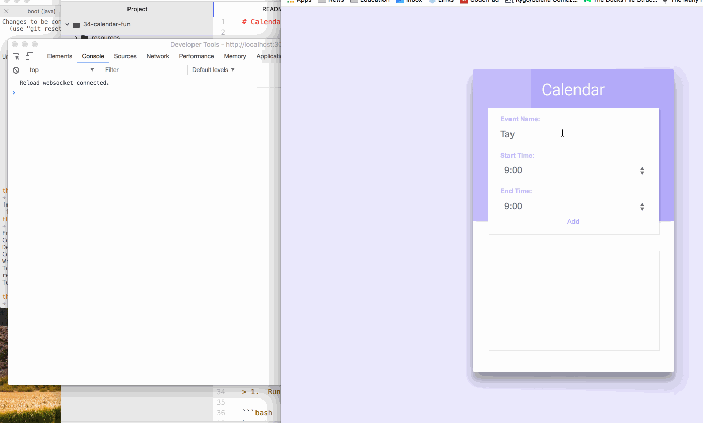

# Calendar Fun

* [Housekeeping](#housekeeping)
* [Quickstart](#quickstart)
* [Walkthrough](#walkthrough)
* [Todo](#to-do)



# Housekeeping

Please ensure you have a clojure environment running locally - see [Getting Started Guide](https://github.com/tkjone/clojurescript-30#getting-started) if you need to set one up.

# Quickstart

These commands will get the app up and running for local development.  Be sure to run the following comamnds from the root of `34_calendar_fun`.

## Local Development

**1.  Run the project**

```bash
boot dev
```

**2.  Visit the app**

http://localhost:3000/

Try adding some events.  If you add 2 events, and some of them conflict, a message will appear in the browsers dev console.


## Run Tests

**1.  Run the tests**

```bash
boot test-cljs --js-env=node
```

The above will run tests for the cljs.  We only have CLJS code so we are going to do the above.  Why set to node JS env?  Well, because chances are considerably higher that the developer already has node on their local machines compared to phantomjs - phantomJS being the default js environment for `boot-test-cljs`.  The other reason is because while the phantomJS project likely still lives, even the original maintainer was not game to continue developing it since chrome headless was released.

# Walkthrough

> Design a calendar for someone who works 9am-5pm (work-life balance is built into this calendar :wink:).  Each calendar event is a minimum of 15 minutes and must always be incremented in 15 minute blocks. The killer feature for this app is that you calendar must let users know when their events are conflicting with other events on the calendar.

In our Calendar, an `Event` is stored as a vector with a **start time** and **end time**: `[9 12]`.  In this example, the Event is scheduled for `9 (9:00AM) - 12 (12:00PM)`.  As mentioned, Events are scheduled for 15 minute blocks, so this is also a valid Event: `[9.25 13]` which would be `9:15AM - 1:00PM`.

**Assumptions:**

* The events will not be recieved in order

**Approach**

* Sort the meetings by start time
* If the the start of the second meeting is less than the end of the first meeting this is a conflict

## To Do

- [X] Cleanup styles.css
- [X] Block user from selecting an end time that is before for the start time + visa-versa
- [X] Improve naming conventions
- [X] Improve organizational structure of application
- [X] Fix `:when` modifier in `find-conflicts`
- [X] Use hiccup for component rendering functions
- [X] Write tests for CLJS code
- [ ] Answers to questions
  - difference between a list comprehension and for loop
  - why not use map?
  - why not use map and reduce?
  - why not use a loop?
- [ ] Add spec
- [ ] Align code to style guide - conistency
- [ ] Add events to localstorage
- [ ] More google closure library - goog/dom

## Default Function Arguments

One way to achieve default function arguments is to use clojure's `multi-arity` functionality.  For example, we have the following piece of code:

```clojure
(defn generate-times
  "Generates a vector of times.
  For example, `[9 9.25 9.5 ...]`"
  []
  (take 33 (iterate inc-15-min  9)))
```

Eventually, I realized that I would like to have the `33` and the `9` be dynamic so this function can be resused.  However, the original use case of `33` and `9` are still valid.  To make this happen we can do something like this:

```clojure
(defn generate-times
  "Generates a vector of times.
  For example, `[9 9.25 9.5 ...]`"
  ([]
   (generate-times 33 9))
  ([hours start-time]
   (take hours (iterate inc-15-min start-time))))
```

What makes this interesting is because if this was JavaScript, the go-to would likely be add defaults to the args.

## Hiccup/s

You may notice when I write my functions that produce HTML like `event-card` and `time-option` they are functions that return strings.  Inside of the strings is HTML.  It looks gnarly because of the escape characters (`\`) and concatenation, but when I send that to the the browser, it will render as HTML.

Now while you could continue doing this, the Clojure community has provided a few libraries that can make writing HTML in our code a little more pleasent to work with:

>  Side note:  This is tantamount to writing `JSX` or using `createElement` in React.  If you are using Reagenent, they actually use a similar DSL as Hiccup under the hood.

These libraries are called [hiccup](https://github.com/weavejester/hiccup) and [hiccups](https://github.com/teropa/hiccups).  The difference between the two is that `hiccup` is meant to be used in CLJ, whereas `hiccups` is meant to be used in CLJS.

In addition to making it easier to write HTML in CLJ/S, when we write the functions with strings instead of something like hiccup/s we run into the following issues:

* With strings it is easy to make mistakes
* With strings it is difficult to read
* With strings it is difficult to maintain

The following is a little comparison of what it looks like before and after we implemented hiccup:

**before**

```clojure
(defn event-card
  "Wrap an event in an event HTML component - returns a string"
  [event]
  (str "<div class=\"root-event\">"
         "<p class=\"event-title\">" (event :name) "</p>"
         "<p class=\"event-time\">" (format-time (event :start-time)) " - " (format-time (event :end-time)) "</label>"
       "</div>"))
```

**After**

```clojure
(defn event-card
  "Wrap an event in an event HTML component - returns a string"
  [event]
  (html
    [:div {:class "root-event"}
     [:p  {:class "event-title"} (event :name)]
     [:p  {:class "event-time"} (format-time (event :start-time)) " - " (format-time (event :end-time))]]))
```

**After (again)**

```clojure
(defn event-card
  "Wrap an event in an event HTML component - returns a string"
  [event]
  (html
    [:div.root-event
     [:p.event-title (event :name)]
     [:p.event-time  (format-time (event :start-time)) " - " (format-time (event :end-time))]]))

```

If you are interested in seeing what more non-hiccup code would look like in ClojureScript checkout [this commit](https://github.com/tkjone/clojurescript-30/commit/c0aeccad00498bb0de2d461531fe33bd91e2a6c1) in the repo - it is the commit before I converted over to Hiccups.
